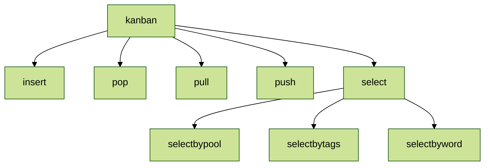

# Welcome to KanBanZ

## 这是我们计划提供的能力

[-]记录预备池   
[-]预备池添加到就绪池   
[-]就绪池添加到执行池   
[-]就绪池添加到酱油池   
[-]执行池添加到完成池   
[-]酱油池添加到备忘录   
[-]执行池添加到日历   
[-]完成池添加到归档   
[-]执行池添加到阻塞池   
[-]阻塞池添加到就绪池   

```mermaid
%%{init: {'theme':'forest'}}%%
graph TD
    A[insert]
    B[pop]
    C[pull]
    D[push]
    E[selectbypool]
    F[selectbytags]
    G[selectbyword]
    H[select]
    K[kanban]
    K -->A
    K -->B
    K -->C
    K -->D
    K -->H
    H -->E
    H -->F
    H -->G

```
